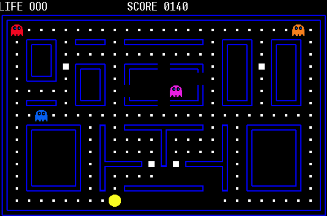

# Simple Pacman Clone

This project is a simple implementation of the classic Pacman game, developed in MASM x32 assembly language.
It utilizes a custom canvas library included in the project folder for rendering the game graphics.

## Features

- **Classic Gameplay**: Navigate through the maze, eat dots, and avoid ghosts to score points.
- **Power-Ups**: Consume power-ups to temporarily eat ghosts and earn extra points.
- **Lives**: The player starts with three lives. Coming into contact with a ghost without having consumed a power-up results in a loss of life.
- **Simple Controls**: Use the WASD keys to control Pacman's movement through the maze.
- **Custom Canvas Library**: A specially designed canvas library for rendering graphics in MASM x32.

## Getting Started

To play the game, download the project files to your local machine. Ensure you have a MASM x32 environment set up to compile and run assembly language programs.

### Installation

1. Clone the repository or download the project files.
2. Navigate to the project directory.
3. Compile the game using the MASM x32 compiler with the provided makefile or your preferred compilation method.
4. Run the executable generated by the compilation process.

## Controls

- **W**: Move Up
- **A**: Move Left
- **S**: Move Down
- **D**: Move Right

## Screenshots

